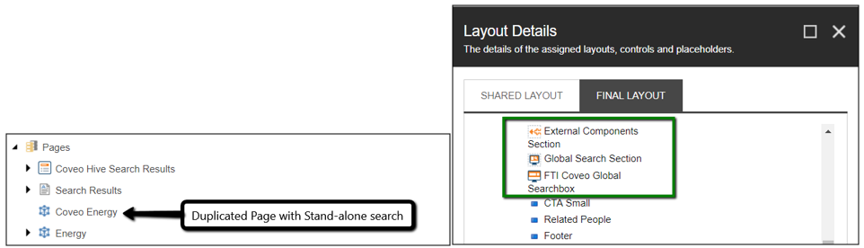

Coveo Hive for Sitecore introduces a new level of modularity, an experience editor friendly eco-system of customizable components. A challenge with this modularity we will be going over is with existing pages and what it takes to swap out old search components for Coveo Hive components.

===

## The Scenario
In my scenario, we're dealing with a complete Sitecore Implementation where Coveo has been tacked on. Let's say that we've just finished implementing a Coveo Search Results page for a particular section. After the search results page usually comes an example implementation of a Page that has stand-alone search behavior that redirects the user to the search results page. Let's also say that this has been configured on an example page for now by adding the Coveo Hiv Search Box component within a Search Section and an External Components Section and pointing the Search box to the search results page:



## The Process
This process of setting up the Coveo stand-alone search behavior has to be done within Experience Editor due to dynamic placeholders and can take roughly 10-15 minutes per Page. In many cases, this example page with stand-alone search behavior has to be switched out on every page that previously had a searchbox. Handling this manually could take over a day to configure during a deployment to CM. A first thought could be to configure this within Std Values, but then you would have to reset every item's Rendering Definition back and completely lose any overrides of components per page. By using Sitecore PowerShell we can maintain the positioning of the searchbox, dynamic placeholder matches, and versioning of each item that is swapped.

### SPE Script: Swap out Renderings

```PowerShell
##########################################################
#
#		This script will switch out old search renderings with new Coveo (custom) Hive Renderings
#			- The new Renderings will maintain the Rendering Parameters and Dynamic Placeholders from the single Page Item that is set up correctly
#			- The old search renderings can be removed from either Shared or Final layout
#
###########################################################

Write-Host "Query for pages that have the old Search Keyword Rendering in either shared or final __renderings"
$queriedItems = Get-Item -Path master: -Query "/sitecore/content/Shared/intelligence/pages/energy//*[contains(@__Renderings, '{D7C47D4D-C50E-4AEF-B805-1ADE1B854605}') or contains(@__Final Renderings, '{D7C47D4D-C50E-4AEF-B805-1ADE1B854605}')]"
Write-Host $queriedItems.Count " items found" -ForegroundColor "Green";	Write-Host ""

$reportOnly = $false
$finalItems = @()

## get a single item that has already been converted
$coveoStandaloneSearchboxContentItem = Get-Item -Path master: -ID "{9921DC61-47D7-4269-9758-749DD785E113}"

## get rendering items
$ri__ExternalComponentsSection = Get-Item -Path master: -ID "{F569344F-3933-45F1-92FE-F6A44159D2AE}"
$ri__GlobalSearchSection = Get-Item -Path master: -ID "{FDCEBA24-58B4-4279-BB7C-E605F5A32307}"
$ri__CustomCoveoGlobalSearchBox = Get-Item -Path master: -ID "{E43BBC7B-2910-4B1E-8320-E3E747516826}"
$ri__CustomCoveoOmniboxResultList = Get-Item -Path master: -ID "{A8C40CF3-F559-47CB-BF6D-15A71C9C9EFD}"

## get rendering instances of renderings that we want to add that are pre-filled with Rendering Parameters (dynamic placeholder, datasource, etc.)
$renderingInstance_ExternalComponentsSection = Get-Rendering -Item $coveoStandaloneSearchboxContentItem -Rendering $ri__ExternalComponentsSection -Device (Get-LayoutDevice "Default") -FinalLayout
$renderingInstance_GlobalSearchSection = Get-Rendering -Item $coveoStandaloneSearchboxContentItem -Rendering $ri__GlobalSearchSection -Device (Get-LayoutDevice "Default") -FinalLayout
$renderingInstance_CustomCoveoGlobalSearchBox = Get-Rendering -Item $coveoStandaloneSearchboxContentItem -Rendering $ri__CustomCoveoGlobalSearchBox -Device (Get-LayoutDevice "Default") -FinalLayout
$renderingInstance_CustomCoveoOmniboxResultList = Get-Rendering -Item $coveoStandaloneSearchboxContentItem -Rendering $ri__CustomCoveoOmniboxResultList -Device (Get-LayoutDevice "Default") -FinalLayout

Write-Host "Swap out old search box rendering for Coveo Searchbox Rendering and Hive counterparts"

$queriedItems | foreach-object {
    ## item must have layout
    if (Get-Layout $_)
    {
        ## TESTING: only perform on single content item that is duplicate
        #if($_.DisplayName -ne "Copy of Consulting") { return }
        
        $isInShared = $false
        
        $renderingToRemove = Get-Rendering -Item $_ -Rendering (Get-Item -Path master: -ID "{D7C47D4D-C50E-4AEF-B805-1ADE1B854605}") -Device (Get-LayoutDevice "Default") -FinalLayout
        if($renderingToRemove -eq $null) {
            $renderingToRemove = Get-Rendering -Item $_ -Rendering (Get-Item -Path master: -ID "{D7C47D4D-C50E-4AEF-B805-1ADE1B854605}") -Device (Get-LayoutDevice "Default")
            $isInShared = $true
        }
        
        ## remove old search box
        if($isInShared){
            Remove-Rendering -Item $_ -Instance $renderingToRemove -Device (Get-LayoutDevice "Default")
        } else {
            Remove-Rendering -Item $_ -Instance $renderingToRemove -Device (Get-LayoutDevice "Default") -FinalLayout
        }
        
        ## add new renderings to *shared
        Add-Rendering -Item $_ -Instance $renderingInstance_ExternalComponentsSection -PlaceHolder $renderingInstance_ExternalComponentsSection.Placeholder -Device (Get-LayoutDevice "Default") -Index 0
        Add-Rendering -Item $_ -Instance $renderingInstance_GlobalSearchSection -PlaceHolder $renderingInstance_GlobalSearchSection.Placeholder -Device (Get-LayoutDevice "Default") -Index 1
        Add-Rendering -Item $_ -Instance $renderingInstance_CustomCoveoGlobalSearchBox -PlaceHolder $renderingInstance_CustomCoveoGlobalSearchBox.Placeholder -Device (Get-LayoutDevice "Default") -Index 2
        Add-Rendering -Item $_ -Instance $renderingInstance_CustomCoveoOmniboxResultList -PlaceHolder $renderingInstance_CustomCoveoOmniboxResultList.Placeholder -Device (Get-LayoutDevice "Default") -Index 3
        
        ## get new rendering instances and set placeholders of each based on their unique ids
        $r1_instance = Get-Rendering -Item $_ -Rendering $ri__ExternalComponentsSection
        $r2_instance = Get-Rendering -Item $_ -Rendering $ri__GlobalSearchSection
        $r3_instance = Get-Rendering -Item $_ -Rendering $ri__CustomCoveoGlobalSearchBox
        $r4_instance = Get-Rendering -Item $_ -Rendering $ri__CustomCoveoOmniboxResultList
        
        $r1_ph = $r1_instance.UniqueId.Substring(1,8).ToLower()
        $r2_ph = $r2_instance.UniqueId.Substring(1,8).ToLower()
        $r3_ph = $r3_instance.UniqueId.Substring(1,8).ToLower()
        $r4_ph = $r4_instance.UniqueId.Substring(1,8).ToLower()
        
        $r2_instance.PlaceHolder = "/pagebody/body/main/rail/coveo-ui-external-components_dynamic_coveo{0}" -f $r1_ph
        Set-Rendering -Item $_ -Instance $r2_instance -FinalLayout
        
        $r3_instance.PlaceHolder = "{0}/coveo-ui-global-searchbox_dynamic_coveo{1}" -f $r2_instance.Placeholder,$r2_ph
        Set-Rendering -Item $_ -Instance $r3_instance -FinalLayout
        
        $r4_instance.PlaceHolder = "{0}/coveo-ui-searchbox-components_dynamic_coveo{1}" -f $r3_instance.Placeholder,$r3_ph
        Set-Rendering -Item $_ -Instance $r4_instance -FinalLayout
        
        $finalItems += $_
        Write-Host $_.name
        #break
    }
}

Write-Host "Final Items" $finalItems.Count -ForegroundColor "Green"
```