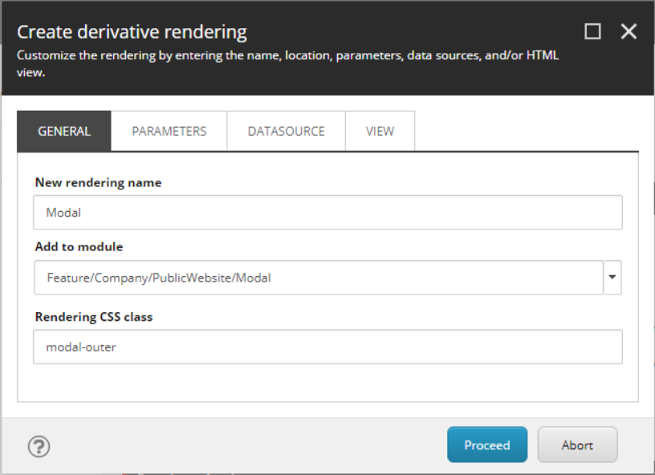
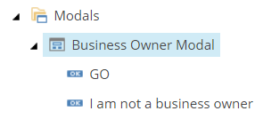

This walkthrough describes in detail how to convert a Bootstrap 4 Modal and properties into a content-authorable custom SXA Component. The SXA Modal will have the ability to add buttons that can either dismiss the modal, redirect, or prevent the modal from re-appearing on future page loads.

===

Starting from SXA v1.8, Bootstrap 4 has been introduced alongside Sitecore 9.1 Initial Release. If you're working from an earlier version of SXA, the same rules should apply. The Helix Pattern is recommended when modeling your templates, but for time and length purposes we will move onward without using interface templates.

## :fa-bar-chart: Bootstrap 4 Analysis
Before we get into Sitecore, we'll need to review the Bootstrap 4 doc in order to come up with a list of Modal properties and content areas that we consider to be content authorable. Outlined below is the Modal markup with considerations or properties between [brackets]. Notice that the majority of these bracket areas are at the top level of the component, aside from the content areas being nested within the markup.

```html
<div class="modal [fade]" tabindex="-1" role="dialog" 
    [data-backdrop="boolean|static", data-keyboard="boolean", data-focus="boolean", data-show="boolean"]>

    <div class="modal-dialog [modal-dialog-centered] [modal-lg, modal-md, modal-sm]" role="document">
        <div class="modal-content">

            <!-- Modal Header is optional: show when Modal Title is present or close icon is enabled -->
            <div class="modal-header">
                <h5 class="modal-title">Modal title</h5>
                
                <!-- close icon can be enabled from rendering parameters -->
                <button type="button" class="close" data-dismiss="modal" aria-label="Close">
                    <span aria-hidden="true">&times;</span>
                </button>
            </div>

            <div class="modal-body">
                <p>Modal body text goes here.</p>
            </div>

            <!-- Modal footer is optional: show when buttons are present -->
            <div class="modal-footer">
                <button type="button" class="btn btn-primary">Save changes</button>
                <button type="button" class="btn btn-secondary" data-dismiss="modal">Close</button>
            </div>
        </div>
    </div>
</div>
```

## :fa-clone: Clone the SXA Promo Component
Our Modal Component will be cloned from the SXA Promo Component in order to retain the Rendering Variant functionality and other important ground work that makes it an SXA Component. Before moving forward with cloning, we have to lay out some of our own ground work in order for the clone script to be successful:
1. Modal Template and Rendering Folders
   - Create a Template folder at:  `/sitecore/templates/Feature/\[Company]/[Site:optional]/Modal`
   - Create a Rendering folder at: `/sitecore/layout/Renderings/Feature/\[Company]/[Site:optional]/Modal`
   
2. Modal Module with Site Setup
   When the cloning script OR a new Site Tenant is being processed, we will want the Modal to be cofigured for the Site and the correct paths in place. This will construct for the Modal: the SXA Available Renderings, Modal Site Data folder, and more optionally configured Scaffolding action items that SXA provides.
   
   - Create the following folder structure: `/sitecore/system/Settings/Feature/\[Company]/\[Site:optional]/Modal`
   - From `/sitecore/system/Settings/Feature` right-click and select **Add Module** to open up the "Create new module" dialog
   - Set **Module Name** to Modal, Set **Add to module group** to the folder structure we created
   - Set **System areas for which container folders should be created** to _at least_ Templates, Renderings, Placeholder Settings, and Layouts
   - Check off from **Module scaffolding actions** Site Setup. Tenant Setup is not required when an SXA Site already exists.

Once completed, the Module will create the scaffolding folders and the scaffolding actions:


Now that we have our SXA Module in place, we can navigate to the SXA Promo Rendering, right-click and run the built-in `Scripts > Clone Rendering` PowerShell script from the context menu. The "Create derivative rendering" dialog will show. Follow each screenshot below for filling in the dialog fields:




When ran, the script will generate all of the missing peices underneath the Rendering, Templates, and Site Data folder. You'll notice that the data templates contain the Promo fields and the Controller Rendering item points to the SXA Variant Controller. The data templates can be renamed to your liking and the generated view placed within the web instance directory should be copied over to the solution for later editing. The Controller Rendering item should eventually have the _Controller_ field pointing to the Modal Feature Project's Controller - in which we will get to that after the next section. 

## :fa-database: Modeling the Template and Rendering Parameters
Based on our analysis of the Bootstrap Modal, we can now modify our modal data template, rendering parameters, and then add an additional data template for the buttons:

### Modal Datasource Template fields
!

- Show Close Icon \[Checkbox]: Enables the close icon on the generated modal. **Since rendering parameters are only accessible from the top markup layers in the view and not the variant fields, we can leverage the Datasource template**.
- Hide With Cookie Name \[Single-line Text]: The Cookie Name and Value are used to initially show the modal on page load when the Cookie is present.
- Hide With Cookie Value \[Single-line Text]
- Modal Title \[Single-line Text]: The modal's title where the Rendering Variant controls the heading markup.
- Modal Body \[Rich-Text]: The modal's body content
- Modal Image \[Image]: An optional image placed above the modal's body content in my Rendering Variant (can be placed anywhere desired in other Rendering Variants)

### Modal Rendering Parameter Template fields


- Modal Size \[Droplist]: Field source points directly to a list of dictionary items with item names `{ modal-sm, modal-md, and modal-lg }`. The value of the item name will be used, but I recommend taking a little more time to set the field to a `Droplink` that has a source of a certain template type.
- All other fields \[Checkbox]
- Standard Values: Go ahead and check _Fade In_ and _Vertically Center Modal_ by default.

### Modal Button Template fields

- Button Label \[Single-line Text]: The button's... label.
- Button Css Class \[Single-line Text]: The button's... CSS Class. I recommend taking a little more time to set this field to a `Multilist` so that the content can pre-select from a list of possible options such as `{ btn-primary, btn-link, ... }`.
- Button Cookie Name \[Single-line Text]: When this Cookie Name and Value are set, this button will be used to set a Cookie that keeps the modal from opening again on page load.
- Button Cookie Value \[Single-line Text]
- Button Link \[General Link]: When the Link is set, this button will act as an anchor tag and redirect the user. When no Link or Cookie Name/Vlaue from above is set, this button will act as a simple modal dismiss action like the close icon.

## :fa-code: Implementing the Modal
With the templates now configured, follow the official SXA guide on how to [Build a Simple Rendering](https://doc.sitecore.com/developers/sxa/17/sitecore-experience-accelerator/en/walkthrough--building-a-simple-rendering.html); doing so will facilitate the Repository injector pattern, the Controller, and the Component Model (or View Model in MVC fashion). The View file created by SXA should also be placed here if not already done so.

### Component/View Model
We will be passing in just the Datasource to to the view, whereas the Rendering Parameters will be initialized in the view. **At this point you may be asking why do we need custom code for this if SXA is about leveraging Rendering Variances to build the markup with the data injected? It's a two-part reason, and one that may be revisited: 1. The sxa div markup is required at the two outer-most levels, but we will want to have the modal markup start within this area so that it is rendered on the page correctly, and 2. Reading in Rendering Parameter data to a Rendering Variant is custom code in itself, along with finding a way to *optionally* set all the modal CSS classes and data attributes on the Variant - you will see what I mean by this once we get to the View code.**
```csharp
public class ModalViewModel : VariantsRenderingModel
{
    public IModal DataSource { get; set; }
}
```

### Repository
Again, nothing special here besides leveraging an ORM to do my interface data mapping.
```csharp
public class ModalRepository : VariantsRepository, IModalRepository
{
    public override IRenderingModelBase GetModel()
    {
        var model = new ModalViewModel();
        var sitecoreContext = new SitecoreContext();

        FillBaseProperties(model);

        if (this.Rendering.DataSourceItem != null)
        {
            var datasource = sitecoreContext.Cast<IModal>(this.Rendering.DataSourceItem);

            model.DataSource = datasource;
        }

        return model;
    }
}
```

### View
The View takes control over the Modal top layer markup in order to render the appropriate options from the Datasource and Rendering Parameters, then simply uses the SXA RenderingVariants Helper to render the variant fields controlled within Sitecore.

```html
@model Enterprise.Feature.XA.Modal.Models.ViewModel.ModalViewModel

@if (Model.DataSourceItem != null || Html.Sxa().IsEdit)
{
    <div @Html.Sxa().Component(Model.Rendering.RenderingCssClass ?? "modal", Model.Attributes)>
        <div class="component-content">
            @if(Model.DataSourceItem == null)
            {
                @Model.MessageIsEmpty
            }
            else
            {
                // retrieve rendering parameters for modal options
                var renderingParams = Html.Glass().GetRenderingParameters<IModalRenderingParameters>();

                string backdropVal = string.Empty, keyboardVal = string.Empty, focusVal = string.Empty,
                    fadeInVal = string.Empty, modalSizeVal = string.Empty, verticallyCenteredClass = string.Empty;

                // set the modal options
                if (renderingParams != null)
                {
                    backdropVal = renderingParams.HasBackdrop ? "static" : "false";
                    keyboardVal = renderingParams.EnableKeyboardUse ? "true" : "false";
                    focusVal = renderingParams.FocusOnModal ? "true" : "false";
                    fadeInVal = renderingParams.FadeIn ? "fade" : string.Empty;
                    modalSizeVal = renderingParams.ModalSize;
                    verticallyCenteredClass = renderingParams.VerticallyCenterModal ? "modal-dialog-centered" : string.Empty;
                }

                // retrieve the modal cookie name and value attributes
                var dataCookieAttrs =
                    !string.IsNullOrWhiteSpace(Model.DataSource.HideWithCookieName) && !string.IsNullOrWhiteSpace(Model.DataSource.HideWithCookieValue) ?
                        new Dictionary<string, string>
                        {
                            {"hide-with-cookie", Model.DataSource.HideWithCookieName},
                            {"hide-with-cookie-value", Model.DataSource.HideWithCookieValue}
                        } :
                        new Dictionary<string, string>();

                <div id="@Guid.NewGuid()" class="modal @fadeInVal" tabindex="-1" role="dialog" aria-hidden="true"
                     @foreach (var property in dataCookieAttrs)
                     {
                         @:data-@(property.Key)='@(property.Value)'
                     } 
                     data-backdrop="@backdropVal" data-keyboard="@keyboardVal" data-focus="@focusVal">
                    
                    <div class="modal-dialog @modalSizeVal @verticallyCenteredClass" role="document">

                        @foreach (BaseVariantField variantField in Model.VariantFields)
                        {
                            @Html.RenderingVariants().RenderVariant(variantField, Model.Item, Model.RenderingWebEditingParams, Model)
                        }

                    </div>

                </div>
            }
        </div>
    </div>
}
```

### CSS Adjustments
In order to support Experience Editor mode, we will need to override some default modal behavior to make the modal show inline and some additional CSS for the Buttons to be stacked instead of inline.

```css
body.on-page-editor .modal {
    display: block;
    position: relative;
    overflow: visible;
}
body.on-page-editor .modal.fade:not(.show) {
    opacity: 1;
}
.modal--stack-buttons .modal .modal-body button {
    display: block;
}
.modal--stack-buttons .modal .modal-body button:not(:first-child) {
    margin-top: 10px;
}
.modal--stack-buttons .modal .modal-body.text-center button {
    margin-left: auto;
    margin-right: auto;
}
```

### JS for Button Cookie Dismissal
In order for the modal buttons to work, we will need to include a script that listens for the Modal Cookie to decide whether to show it or not, and a script that listens for clicks on anything that has the data-cookie attributes - in our case, one of the modal buttons.

**Cookie Click Listener**
```javascript
/*
 * Find all elements with cookie data-attribute and add click listener that sets the Cookie
 */
(function () {
    var elements = document.querySelectorAll('[data-cookie-name]');
    if (elements.length > 0) {
        Array.prototype.forEach.call(elements, function (el, i) {
            var cookieName = el.getAttribute("data-cookie-name");
            var cookieValue = el.getAttribute("data-cookie-value");
            var cookieExpires = (el.getAttribute("data-cookie-expires")) ? (parseInt(el.getAttribute("data-cookie-expires"))) : (365);
            var cookiePath = (el.getAttribute("data-cookie-path")) ? (el.getAttribute("data-cookie-path")) : ('/');
            if (cookieName && cookieValue) { //must provide at least a cookie name and value
                el.addEventListener("click",
                    function () { Cookies.set(cookieName, cookieValue, { expires: cookieExpires, path: cookiePath }); });
            }
        });
    }
})();
```

**Cookie Modal Show/Dismiss Listener**
```javascript
/*
 * Find all elements with cookie data-attribute and add click listener
 */
(function () {
    var showModal = function (id, cookieName, cookieValue) {
        // only show this modal if the given cookie name/value does not match
        if (Cookies.get(cookieName) !== cookieValue) {
            $('#' + id).modal({ show: true })
        }
    }

    // if in page edit mode, do not activate modals
    if (typeof Sitecore !== "undefined" && typeof Sitecore.PageModes !== "undefined" && typeof Sitecore.PageModes.PageEditor !== "undefined") { return }

    var elements = document.querySelectorAll('.modal[role=dialog]');
    if (elements.length > 0) {
        Array.prototype.forEach.call(elements, function (el, i) {
            var cookieName = el.getAttribute("data-hide-with-cookie")
            var cookieValue = el.getAttribute("data-hide-with-cookie-value")

            document.addEventListener("DOMContentLoaded", function () { showModal(el.id, cookieName, cookieValue); });
        });
    }
})();
```

## :fa-pencil-square-o: Creating the Datasource and Associated Content
Before we can get into creating the Rendering Variant, it helps to visualize what the Datasource and associated content required for the modal will look like. Underneath `/sitecore/content/[Company]/[PublicWebsite]/Data/Modals` right-click and insert a Modal, then right-click the modal and insert two modal buttons:


We will go over how to render the child buttons in the next section - but from an experience editor perspective, it's nice to be able to insert child items (buttons) with the Experience Editor Buttons options that provides the content author with a toolbar option:



For the Modal, set **Hide With Cookie Name** to `BusinessPageVisited` and set **Hide with Cookie Value** to `yes`. This Cookie value is mapped to a modal button within the modal that hides the modal on page load for a certain duration of time. You can also set **Modal Title/Body/Image** at this point.

For the Buttons:
- GO: **Button Label** set to `GO`, **Button Css Class** set to `btn btn-primary`, **Button Cookie Name** set to `BusinessPageVisited` (same as the modal above), **Button Cookie Value** set to `yes`, and leave **Button Link** empty
- I am not a business owner: **Button Label** set to `I am not a business owner`, **Button Css Class** set to `btn btn-link`, and **Button Link** set to any internal or external link within your site to where you want your used to redirected to.

## :fa-magic: Creating the Rendering Variant
Locate the Modal Rendering Variant that was created by the Clone script under `/sitecore/content/[Company]/[PublicWebsite]/Presentation/Rendering Variants/Modal`. Before moving forward, review the SXA documentation on [Rendering Variants](https://doc.sitecore.com/developers/sxa/18/sitecore-experience-accelerator/en/create-a-rendering-variant.html). We will model a default Rendering Variant based on our Datasource fields above and the structure we have for our child modal buttons. The screenshot below shows the fully created Rendering Variant for reference:


> note: my naming convention for variant fields is as follows
  1. VariantSection: \[tag] \[{ class or id }] \[other]
  2. VariantField: \[Field Name]

### Variant Fields
- `[Variant Definition]` **Default**: no fields have to be configured here, but this is where you can allow this Variant only for certain pages or to declare a certain Link field as the anchor to wrap around an entire section of the Variant.
- `[VariantSection]` **div modal-content**: set the **Tag** to `div` and the **Css class** to `modal-content`
    - `[VariantSection]` **div modal-header**: set the **Tag** to `div` and set the **Rule** to only show this section when the close icon is enabled or the modal title is not empty  
      
        - `[VariantField]` **h3 modal-title**: set the **Tag** to `h3`, set the **Field name** to `Modal Title` and set the **Css class** to `modal-title`
        - `[VariantTemplate]` **template close button**: renders the static html present in the **Template** field  
        ```html
        <button type="button" class="close" data-dismiss="modal" aria-label="Close">
            <span class="ti ti-close" aria-hidden="true"></span>
        </button>
        ```
    - `[VariantSection]` **div modal-body text-center**: set the **Tag** to `div` and the **Css class** to `modal-body text-center`
        - `[VariantSection]` **p tag image section**: set the **Tag** to `p`. You could render just the Modal Image without this depending on the markup required for your CSS to kick in
            - `[VariantField]` **Modal Image**: set the **Field name** to `Modal Image` and set the **Data attributes** to `class` > `modal-logo`. We don't use the **Css Class** field here because that field is specifically for the **Tag**, but we left that to empty here.
        - `[VariantField]` **Modal Body**: set the **Field name** to `Modal Body`
        - `[VariantPlaceholder]` **Modal Content Placeholder**: set the **Placeholder Key** to `modal-content`
        - `[VariantTemplate]` **Buttons**: the **Template** field loops through the Datasource child items and renders each button as either a cookie button, a redirect link, or a dismiss button. A custom field token method called `$fieldTokens.GetGeneralLinkUrl` is used to generate the correct anchor link - use [this](https://sitecore.stackexchange.com/a/15891/64) link to implement the token.
        <br>
        
        ```
        #foreach($button in $item.Children)

          #set ($cssClass = $button.Fields.get_Item("Button Css Class"))
          #set ($cookieVal = $button.Fields.get_Item("Button Cookie Value").ToString())
          #set ($cookieName = $button.Fields.get_Item("Button Cookie Name").ToString())
          #set ($buttonLabel = $button.Fields.get_Item("Button Label"))
          #set ($buttonLink = $fieldTokens.GetGeneralLinkUrl($button, "ButtonLink"))

          #if ($cookieVal != "")
              <button type="button" data-cookie-value="$cookieVal" data-cookie-name="$cookieName" data-cookie-expires="365" data-cookie-path="/" class="$cssClass" data-dismiss="modal">$buttonLabel</button>
          #elseif ($buttonLink != "")
              <a href="$buttonLink" class="$cssClass">$buttonLabel</a>
          #else
              <button type="button" class="$cssClass" data-dismiss="modal">$buttonLabel</button>
          #end
        #end
        ```

## :fa-check-square: Putting it all together
It's time to see what this Modal can do! Create a new SXA Page, open Experience Editor, and drag and drop our Modal with the created Datasource on to the page:


We can use the `Insert a new Item` or the `Sort content` icons from the toolbar:


We can update the Rendering Parameters from the `Style and Behavior` icon from the toolbar:


And after hitting save, we can review our changes in Preview Mode. Since we've adjusted some modal properties, we can now see the backdrop, a smaller modal size, and the modal being vertically aligned. By clicking on GO, the modal will be dismissed and will not pop up again on page load until either the cookie is cleared or the time expires:

