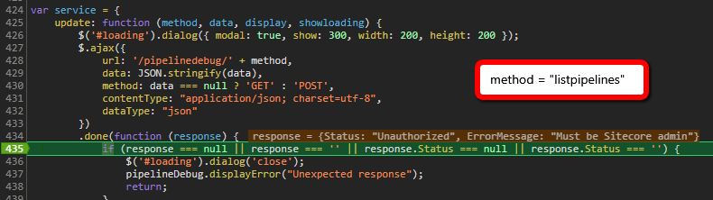

The pipeline.debug Sitecore module, created by Morten Engel, is a fantastic pipeline output visualization tool that requires minimal set up in. While working on Sitecore v9.1.1, I was sad to see that initally the module would not run! In this post I'll quickly provide a work around for getting this great tool back up and running.

===

## The Issue
After logging in to Sitecore as "admin" and navigating to [scheme]://[host]/sitecore/admin/pipelinedebug.html, I noticed that this module page still prompted me to log in. So I took a closer look at the front-end and noticed that it's fairly straight forward to read the main JS file that the modules comes with, `PipelineDebug.js`. In this file you will find a `service.update` method that takes in a method parameter, such as _login_ and _listpipelines_. Appropriate data is then passed via AJAX to a single Controller `/pipelinedebug/[action]`, of which is registered part of the `Sitecore.Mvc.Pipelines.Loader.InitializeRoutes` processor. As seen below in dev console debug mode, the `response.Status` of any method was always returning "Unauthorized":



Decompiling the solution shows us that the `PipelineDebugController` attribute `[AdministratorOnly]` checks for `Sitecore.Context.IsAdministrator`. Hint - we're dealing with a change to the validation identity of unresolved site context possibly because the API calls above do not use a site switcher.

## The Solution
We need to patch in the path of all of these custom routes to the list of `siteNeutralPaths` within the `ValidateIdentity.ValidateSiteNeutralPaths` processor like so:
``` xml
<processor type="Sitecore.Owin.Authentication.Pipelines.CookieAuthentication.ValidateIdentity.ValidateSiteNeutralPaths, Sitecore.Owin.Authentication">
    <path>/pipelinedebug/pipelinedetails</path>
    <path>/pipelinedebug/addprocessor</path>
    <path>/pipelinedebug/moveprocessor</path>
    <path>/pipelinedebug/getdebugprocessors</path>
    <path>/pipelinedebug/removeprocessor</path>
    <path>/pipelinedebug/getdiscoveryroots</path>
    <path>/pipelinedebug/discover</path>
    <path>/pipelinedebug/getsettings</path>
    <path>/pipelinedebug/savesettings</path>
    <path>/pipelinedebug/getoutput</path>
    <path>/pipelinedebug/exportconfiguration</path>
    <path>/pipelinedebug/importconfiguration</path>
    <path>/pipelinedebug/saveprocessortaxonomies</path>
    <path>/pipelinedebug/listpipelines</path>
    <path>/pipelinedebug/login</path>
    <path>/pipelinedebug/logout</path>
    </siteNeutralPaths>
</processor>
```
Once this is patched in and saved, you will be able to now see the list of pipelines and not get any further authorization issues in the pipeline.debug admin page.