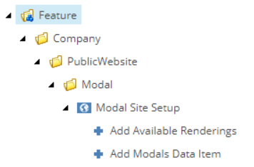
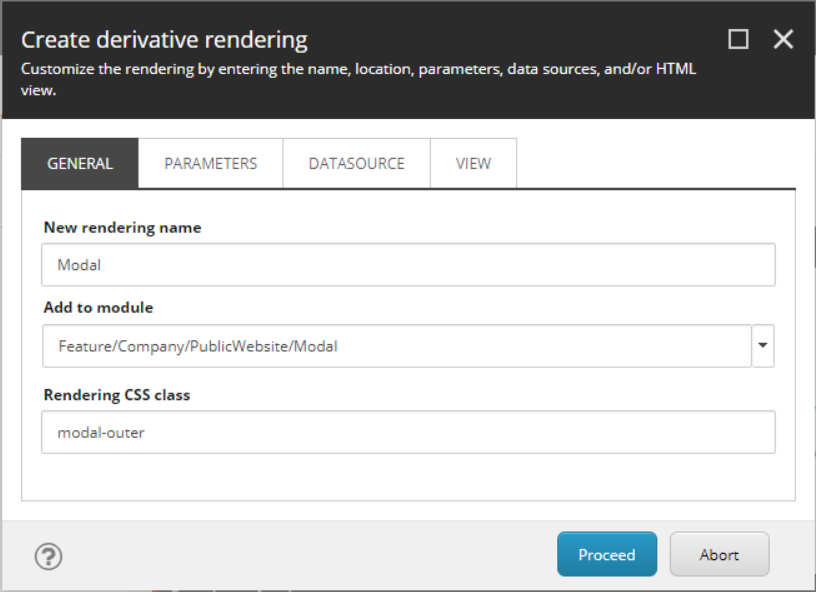
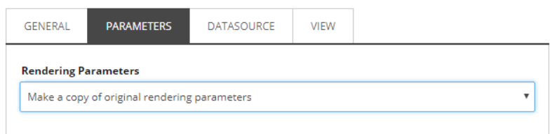
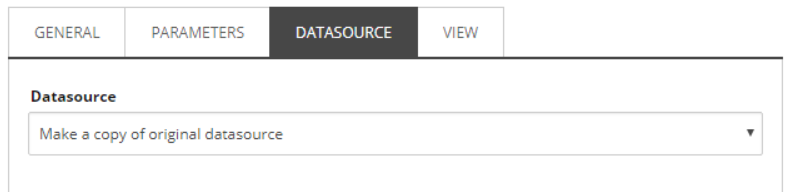
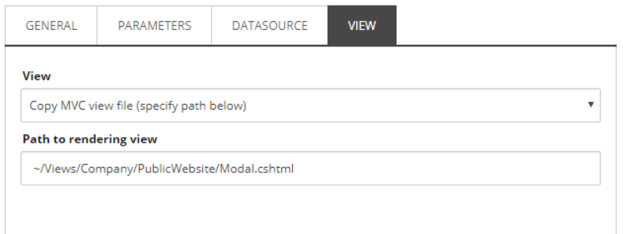

This walkthrough describes in detail how to convert a Bootstrap 4 Modal and all of it's properties into a content-authorable custom SXA Component, along with the ability to add Modal buttons.

===

Starting from SXA v1.8, Bootstrap 4 has been introduced alongside Sitecore 9.1 Initial Release. If you're working from an earlier version of SXA, the same rules should apply. The Helix Pattern is recommended when modeling your templates, but for time and length purposes we will move onward without using interface templates.

## Bootstrap 4 Analysis
Before we get into Sitecore, we'll need to review the Bootstrap 4 doc in order to come up with a list of Modal properties and content areas that we consider to be content authorable. Outlined below is the Modal markup with considerations or properties between [brackets]. Notice that the majority of these bracket areas are at the top level of the component, aside from the content areas being nested within the markup.

```html
<div class="modal [fade]" tabindex="-1" role="dialog" 
    [data-backdrop="boolean|static", data-keyboard="boolean", data-focus="boolean", data-show="boolean"]>

    <div class="modal-dialog [modal-dialog-centered] [modal-lg, modal-md, modal-sm]" role="document">
        <div class="modal-content">

            <!-- Modal Header is optional: show when Modal Title is present or close icon is enabled -->
            <div class="modal-header">
                <h5 class="modal-title">Modal title</h5>
                
                <!-- close icon can be enabled from rendering parameters -->
                <button type="button" class="close" data-dismiss="modal" aria-label="Close">
                    <span aria-hidden="true">&times;</span>
                </button>
            </div>

            <div class="modal-body">
                <p>Modal body text goes here.</p>
            </div>

            <!-- Modal footer is optional: show when buttons are present -->
            <div class="modal-footer">
                <button type="button" class="btn btn-primary">Save changes</button>
                <button type="button" class="btn btn-secondary" data-dismiss="modal">Close</button>
            </div>
        </div>
    </div>
</div>
```

## Clone the SXA Promo Component
Our Modal Component will be cloned from the SXA Promo Component in order to retain the Rendering Variant functionality and other important ground work that makes it an SXA Component. Before moving forward with cloning, we have to lay out some of our own ground work in order for the clone script to be successful:
1. Modal Template and Rendering Folders
   - Create a Template folder at:  `/sitecore/templates/Feature/[Company]/[Site:optional]/Modal`
   - Create a Rendering folder at: `/sitecore/layout/Renderings/Feature/[Company]/[Site:optional]/Modal`
   
2. Modal Module with Site Setup
   When the cloning script OR a new Site Tenant is being processed, we will want the Modal to be cofigured for the Site and the correct paths in place. This will construct for the Modal: the SXA Available Renderings, Modal Site Data folder, and more optionally configured Scaffolding action items that SXA provides.
   
   - Create the following folder structure: `/sitecore/system/Settings/Feature/[Company]/[Site:optional]/Modal`
   - From `/sitecore/system/Settings/Feature` right-click and select **Add Module** to open up the "Create new module" dialog
   - Set **Module Name** to Modal, Set **Add to module group** to the folder structure we created
   - Set **System areas for which container folders should be created** to _at least_ Templates, Renderings, Placeholder Settings, and Layouts
   - Check off from **Module scaffolding actions** Site Setup. Tenant Setup is not required when an SXA Site already exists.

Once completed, the Module will create the scaffolding folders and the scaffolding actions:


Now that we have our SXA Module in place, we can navigate to the SXA Promo Rendering, right-click and run the built-in `Scripts > Clone Rendering` PowerShell script from the context menu. The "Create derivative rendering" dialog will show. Follow each screenshot below for filling in the dialog fields:






When ran, the script will generate all of the missing peices underneath the Rendering, Templates, and Site Data folder. You'll notice that the data templates contain the Promo fields and the Rendering points to the SXA Variant Controller. We will keep the Controller Rendering as is since it already does the SXA rendering variant work for us that passes data to our new view. The data templates can be renamed to your liking and the generated view placed within the web instance directory should be copied over to the solution for later editing.

## Modeling the Template and Rendering Parameters

